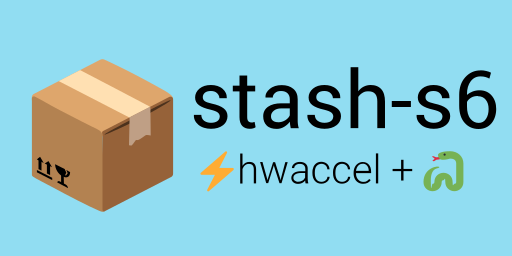

# stashapp/stash with(out) s6

for [stashapp/stash#4300](https://github.com/stashapp/stash/issues/4300)
- non-root user support
  - PUID/ PGID switching support
- TZ settings
- CUDA/ QSV images
  - NVENC encoding session patches
- automatic python dependency installs

-----
# Tags

## `latest` / `alpine` 

```
ghcr.io/feederbox826/stash-s6:alpine
```
no hardware acceleration, built on alpine linux
## `hwaccel` 

```
ghcr.io/feederbox826/stash-s6:hwaccel
```
hardware acceleration from [jellyfin-ffmpeg](https://jellyfin.org/docs/general/administration/hardware-acceleration/), built on debian. (Scheduled to be replaced with v0.29.0 [#46](https://github.com/feederbox826/stash-s6/issues/46))

## `hwaccel-alpine` 

```
ghcr.io/feederbox826/stash-s6:hwaccel-alpine
```
hardware acceleration from [jellyfin-ffmpeg](https://jellyfin.org/docs/general/administration/hardware-acceleration/), built on alpine

## `-develop` variants 

Append `-develop` to the tag to run the development builds of stash
- `develop` / `alpine-develop` 
- `hwaccel-develop` 
- `hwaccel-alpine-develop` 

Date suffixes are also available for point-in-time snapshotting.

## environment variables
`PUID` - Process User ID  
`PGID` - Process Group ID  
`AVGID` - Additional Group ID (usually for ARC GPU)

`SKIP_NVIDIA_PATCH` - skips patching nvidia driver for multi-stream nvenc. see [keylase/nvidia-patch](https://github.com/keylase/nvidia-patch?tab=readme-ov-file#version-table) for supported drivers  
`TZ` - timezone  
`CUSTOM_CERT_PATH` - Path to custom root certificates to be added to stash (defaults to `/config/certs`)  

## migration-specific environment variables
`MIGRATE` - automatic migration from `stashapp/stash` or `hotio/stash`

## Run modes
### `stashapp/stash compatibility`
I want to keep using the `stashapp/stash` image or possibly switch back
- Replace `image: stashapp/stash` with your desired image
- You will see a message `Running in stashapp/stash compatibility mode...`

### Migration from `stashapp/stash` or `hotio/stash`

> [!WARNING]
> Switching back is difficult and requires manual configuration

- Replace `image: stashapp/stash` with your desired image
- Set the environment variables
  ```
  MIGRATE=TRUE
  ```
- Add the following volumes alongside your existing mounts. It should look like
```
volumes:
  - /data/old-stash/config:/root/.stash
  - /data/new-stash/config:/config
  - /data/new-stash/pip-install:/pip-install
```